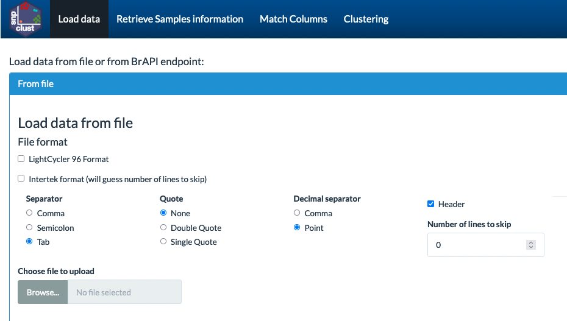
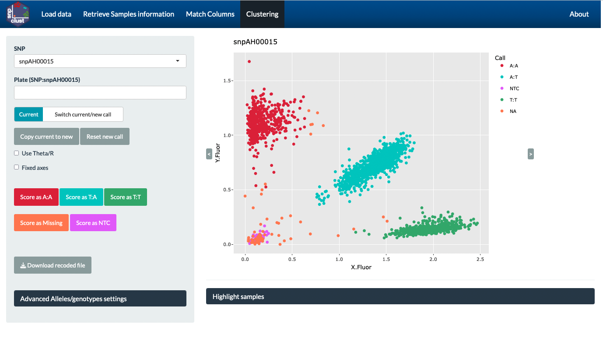

# Version 0.2 (01/09/2017)

## Installation

Install devtools package if not already done

```{r}
install.packages(devtools)
```
Load devtools then install snpclust package

```{r}
library(devtools)
install_github("jframi/snpclust")
```
Then load snpclust

```{r}
library(snpclust)
```


## Usage


### Shiny app for manual clustering

After installing the package, the shiny app can be run using:

```{r}
runmanclust()
```
Choose an input file that contain fluorescence values and calls for one or several SNPs and one or several DNA plates.  
  
Adjust the file format to read correctly the input file.  
  
Match the columns of your file to the column that the app is expecting  
  
You can select SNPs, DNA plates to display current clustering, select individual genotypes in the plot using the lasso tool, and recall selected points.  
  


