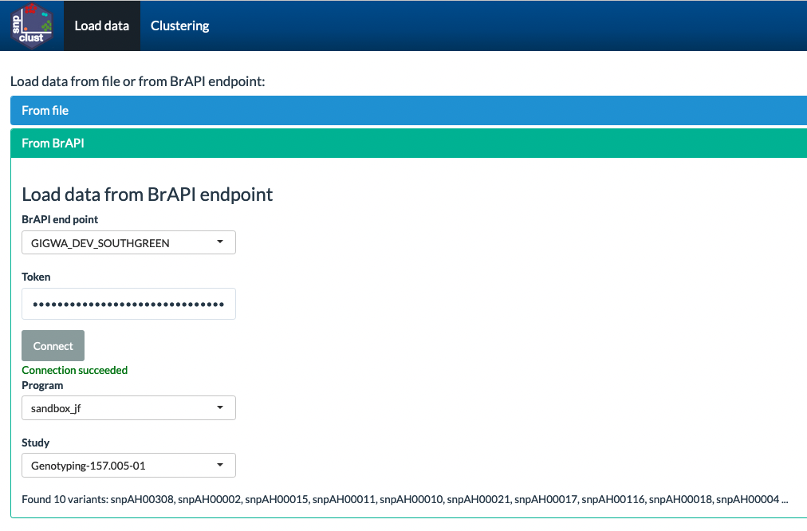

# Version 1.1 (20/06/2024)

## Installation

Install remotes package if not already done

``` r
install.packages(remotes)
```
Install snpclust package

``` r
remotes::install_github("jframi/snpclust")
```
Then load snpclust

``` r
library(snpclust)
```


## Usage


After installing the package, the shiny app can be run using:

``` r
runmanclust()
```

### Load data from file
Choose an input file that contain fluorescence values and calls for one or several SNPs and one or several DNA plates. 
<br/><br/> 
<kbd>
  
</kbd>
<br/><br/>
Adjust the file format parameters to read the input file. Format parameters are OK when the first rows of your files appear correctly.  
<br/><br/>
  
<br/><br/>
Match the columns of your file to the column names that the app is expecting, then click OK.  
<br/><br/>
 
<br/><br/>
Then select a SNP and possibly a Plate to display a scatter plot of fluorescence values.    
<br/><br/>
  
<br/><br/>
You can switch to Show New Call view, select individual genotypes in the plot using the lasso tool, and score selected points.  
<br/><br/>
  

### Use BrAPI
BrAPI can be used at two different levels in the app:  
- To retrieve sample metadata when genotyping data are loaded from a file in which samples are identified with sampleDbIds that can be found at a BrAPI endpoint
- To retrieve genotyping data from a BrAPI endpoint that implements Genotyping section of BrAPI

To use BrAPI, it is required to define BrAPI endpoints before running the application.  

``` r
options(brapi.cons=list(GIGWA_SOUTHGREEN=brapirv2::brapi_connect(secure = TRUE,
                                                                 protocol = "https://",
                                                                 db = "gigwa.southgreen.fr",
                                                                 port = 80,
                                                                 apipath = "gigwa/rest",
                                                                 multicrop = FALSE,
                                                                 granttype = "token",
                                                                 clientid = "brapir",
                                                                 bms = FALSE),
                        My_BMS_Server=brapirv2::brapi_connect(db="mybms.bmspro.io",
                                                              port=80,
                                                              bms=F,
                                                              secure = TRUE,
                                                              protocol = "https://",
                                                              apipath = "bmsapi",
                                                              granttype = "token",
                                                              multicrop = TRUE,
                                                              commoncropname = "mycrop")))
```


#### Retrieve samples information
One a file with genotyping data has been loaded, sample metadata can be retrieved from a BMS BrAPI endpoint.  
Select the BMS connection endpoint, provide a token and click on Connect
<br/><br/>
  
<br/><br/>
Select the BMS program and click on "Fetch samples information".
<br/><br/>

<br/><br/>
Then click on Update samples information and use the Sample_Plot_Label and Sample column in the Match columns step.
<br/><br/>

#### Load data from BrAPI
To load genotyping data directly from a BrAPI endpoint, select "From BrAPI" in the Load data tab.  
Select the BrAPI endpoint, provide a token and click on Connect.  
Then select a Program and a Study and proceed directly to the Clustering Tab.  
<br/><br/>


#### Launch snpclust with BrAPI connection settings passed through the url
snpclust can be invoked with BrAPI connection seetings passed as URL parameters.  
URL parameters are:
- mainapiURL: the is the url of the BrAPI endpoint
- mainbrapiprogram: BrAPI programDbId
- mainbrapistudy: BrAPI studyDbId
- maintoken: authorized token to access data


